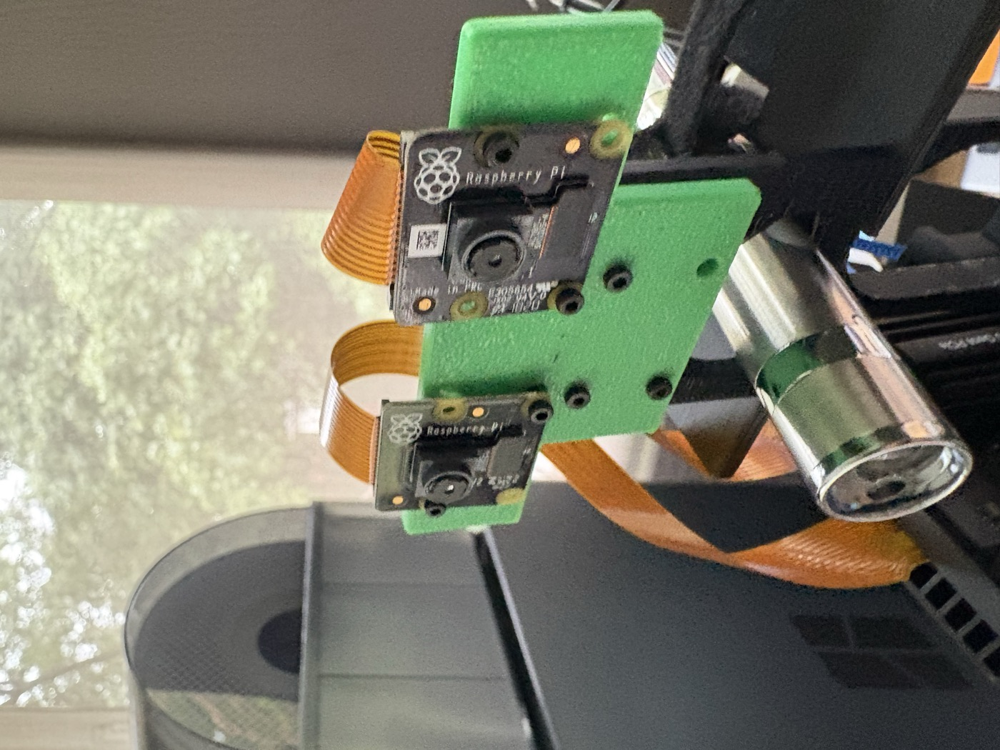
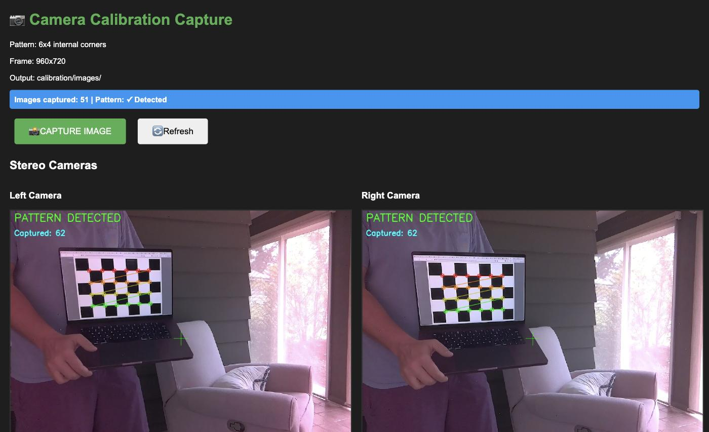
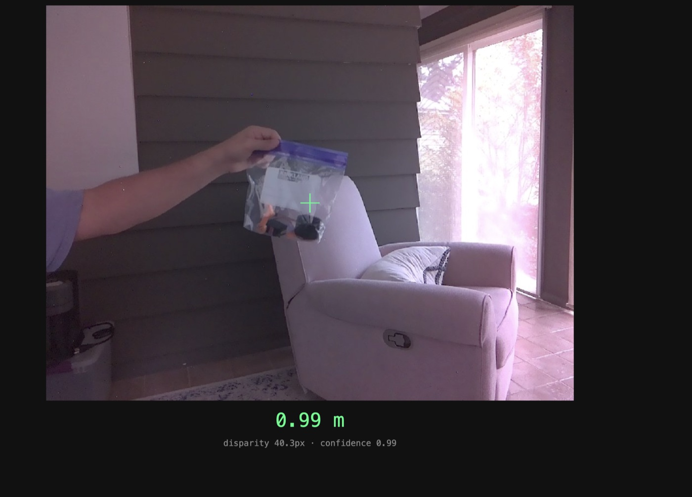

# stereo-csi

Build your own **stereo depth camera** from two Raspberry Pi camera modules on
a Jetson — capture, calibration, and metric depth in ~800 lines of Python.
Extracted from a working robot turret project (it ranges a soda can at 0.6–2.5 m
well enough to aim at it).

How it works, in one line of math: two cameras a known distance apart (the
*baseline*) see the same object at slightly different horizontal pixel
positions (the *disparity*), and similar triangles give

```
depth_mm = focal_length_px × baseline_mm / disparity_px
```

## Bill of materials

| Item | Qty | ~Price | Notes |
|---|---|---|---|
| Raspberry Pi Camera Module V2 (IMX219, 8MP) | 2 | $25 ea | Identical modules matter — same sensor, same lens |
| [Arducam Pi Zero camera cable set (22-pin to 15-pin)](https://www.amazon.com/dp/B085RW9K13) | 1 set (3 lengths) | $9 | **Required:** the Jetson Orin Nano CAM ports are 22-pin 0.5 mm pitch, but Pi Camera V2 modules are 15-pin 1 mm — these Pi Zero-style flex cables adapt between them. The 150 mm length reaches the mount |
| NVIDIA Jetson Orin Nano dev kit | 1 | $250 | Any board with **two** CSI ports works (Orin Nano/NX carriers) |
| 3D-printed stereo mount | 1 | ~$1 of PLA | `hardware/stereo-mount.stl` — holds both modules rigidly at a fixed baseline |
| M2 screws + heat-set inserts | 8 | $5/kit | Camera PCB mounting holes are M2 |
| A rigid ruler or calipers | 1 | — | You must measure two things: the checkerboard square and the lens spacing |

Total: **~$315**, most of it the Jetson you probably already have.

**The mount is the actual product.** Stereo calibration assumes the cameras
never move relative to each other — a rigid, printed mount with both PCBs
screwed down is the difference between a calibration that holds and one that
drifts every time a ribbon cable is bumped. Print `hardware/stereo-mount.stl`
(PLA is fine), install heat-set inserts, and screw both modules in before
calibrating. As printed, the lens centers sit ~52.5 mm apart — **measure yours
with calipers**; you'll need the number later.

<p align="center">
  
</p>

## 1. Wire and verify capture

Plug the cameras into the two CSI ports using the 22-pin-to-15-pin flex
cables (15-pin end into the camera, 22-pin end into the Jetson; contacts face
the board on the Jetson side — seat them fully and close the latch, a
half-seated flex is the #1 "no camera found" cause). **Port mapping on the
Jetson:** the
physical connectors (CAM0/CAM1 on Orin Nano dev kits) enumerate as
`nvarguscamerasrc sensor-id=0` and `sensor-id=1`; this library's `camera_id`
is that sensor id — in stereo mode `camera_id` is the **left** camera and
`camera_id + 1` the right (see `stereo_csi/camera_source.py`). If your left
image comes from the physically-right camera, either swap the ribbon
connectors or swap which module sits in which side of the mount — left/right
must match or all disparities come out negative. Verify what the OS sees with
`v4l2-ctl --list-devices` (needs `v4l-utils`), and note that some carrier
boards require enabling the CSI lanes once via `sudo /opt/nvidia/jetson-io/jetson-io.py`. Capture is done with a GStreamer `nvarguscamerasrc` pipeline wrapped in
`stereo_csi/csi_camera.py`; `stereo_csi/camera_source.py` pairs the two into
synchronized-enough left/right frame reads:

```python
from stereo_csi import CameraSource, CSICameraCapture

camera = CameraSource(enabled=True, camera_id=0, use_csi=True,
                      stereo_mode=True, invert_camera=False, video_fps=30,
                      output_width=960, output_height=720,
                      csi_capture_factory=CSICameraCapture)
camera.initialize()
left, right = camera.read_frames()
```

The IMX219 is captured at 1640×1232 (full field of view) and scaled to
960×720. If you change the working resolution later, you must recalibrate.

## 2. Calibrate — with a laptop screen as the checkerboard

You need a checkerboard of precisely known square size. You don't need to
print one: **open `calibration/checkerboard_6x4_screen.html` full-screen on a
laptop** (F11 / ⌃⌘F). A flat, backlit LCD is actually a *better* calibration
target than most printouts — paper curls, screens don't.

One catch: the on-screen square size depends on your screen, so **measure one
square with a ruler or calipers** (edge to edge, in mm). Measure across
several squares and divide if that's easier. On the 14" laptop this was
developed against, full-screen squares measured **37 mm** — yours will differ.

Then run the capture helper on the Jetson. It serves a small web page with
both camera previews and **only saves a pair when the checkerboard is detected
in both cameras simultaneously**:

```bash
python3 calibration/capture_calibration.py \
  --web --use-csi --stereo --pattern 6x4 \
  --width 960 --height 720 \
  --output calibration/images --port 8010
```

Open `http://<jetson>:8010`, hold the laptop screen in front of the rig, and
capture **40–60 pairs**:

<p align="center">
  
</p>
 near and far, all four corners of the frame, and
tilted at varying angles (the tilts are what pin down the lens distortion).
Keep the screen still for each shot — motion blur ruins corners.

Then solve the calibration, passing the square size you measured:

```bash
python3 calibration/calibrate_camera.py \
  --stereo \
  --left  "calibration/images/left/*.jpg" \
  --right "calibration/images/right/*.jpg" \
  --pattern 6x4 --square-size 37 \
  --output calibration/output
```

Quality bar: **stereo RMS under ~1 pixel** is usable (the reference build
achieved 0.810 px). If you're above that, capture more varied poses — and
check the mount screws.

The solver also reports a *solved baseline*. It's often a few mm off (the
reference solve said 41.6 mm for a physically 52.5 mm spacing — screen-target
calibrations are good at distortion, mediocre at absolute scale). That's why
you measured the lens spacing with calipers: pass the **physical** number as
`baseline_override` everywhere you use depth, and absolute distances come out
right.

## 3. Get depth

```bash
python3 examples/depth_preview.py \
  --calibration calibration/output/stereo_calibration.npz \
  --baseline-override 52.5
```

Prints the depth at frame center once per second. For a browser version:

```bash
python3 examples/depth_web.py \
  --calibration calibration/output/stereo_calibration.npz \
  --baseline-override 52.5
```

then open `http://<jetson>:8011` — live camera view with a crosshair and the
distance to whatever is under it (click to move the measurement point). No
model, no inference loop; this is the depth stack by itself.

<p align="center">
  
</p>
<p align="center"><i>A sandwich bag at arm's length, scientifically calibrated to exactly 0.99&nbsp;m — where "scientifically" means a tape measure, held approximately level, read to whatever precision an outstretched arm allows. The stereo rig agreed anyway (disparity 40.3&nbsp;px, confidence 0.99).</i></p> `StereoDepthService` handles
rectification, block matching, and turns any pixel coordinate into a
millimeter measurement with a confidence score:

```python
from stereo_csi import StereoDepthService

depth = StereoDepthService(calibration_file="calibration/output/stereo_calibration.npz",
                           baseline_override=52.5, image_size=(960, 720))
depth.load_calibration()
m = depth.calculate_depths(left, right, [(480, 360)])[0]
print(m.depth_mm, m.disparity_px, m.confidence)
```

An example calibration from the reference rig is in
`examples/example_stereo_calibration_960.npz` — useful for exercising the API
before your own calibration exists (its intrinsics won't match your cameras).

## Limitations worth knowing

- **Low texture kills disparity.** Blank walls and glossy cans return no
  match; the service reports low confidence rather than lying. Point it at
  textured scenes when evaluating.
- **Depth resolution falls off with distance squared.** With a 52.5 mm
  baseline at 960 px, expect useful metric depth to ~3 m, degrading fast after.
  Want more range? Print a wider mount — everything else stays the same.
- The two CSI captures are started together but not hardware-synchronized;
  fast-moving scenes can show slight left/right time skew.

## Layout

```
stereo_csi/        capture (CSI GStreamer, stereo pairing) + depth service
calibration/       checkerboard page, web capture helper, stereo solver
examples/          depth_preview.py + example calibration file
hardware/          stereo-mount.stl (print this first)
```
